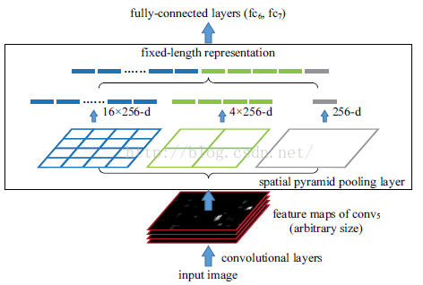
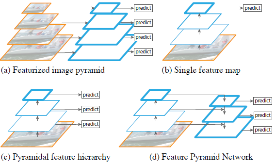
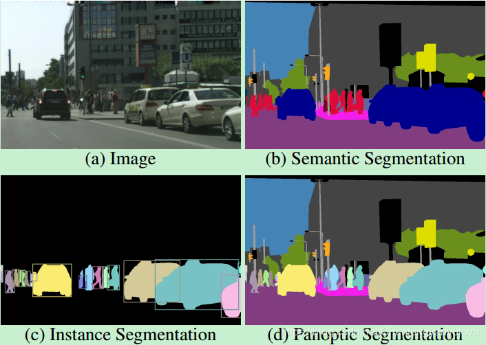

# 目标检测算法

## 参考资料
### 视频
- [目标检测算法 慕课网](https://www.bilibili.com/video/av70977633) 非常全，包含通用目标检测和人脸检测的许多经典论文
- [旷视科技资深研究员俞刚-Beyond RetinaNet & Mask R-CNN](https://www.bilibili.com/video/av29340771)

### 文章

## 方法分类
- 传统算法
  - VJ（Haar + Adaboost + SVM）
  - HOG & SVM
  - DPM
- 深度学习方法
  - two stage
    - R-CNN
      - selective search + *resize* + deep feature extract + *svm*
    - SPP Net
      - Kaiming He等人的工作（Res Net的四个作者）
      - 针对候选框size不一致提出一种多尺度金字塔池化，做全局3x3,5x5的池化,flatten,concat
      - 将推荐区域对应的特征图而不是原始图像送入网络中进行reg & cls,避免卷积的重复计算
      - 
    - fast RCNN
      - RBG（MS）
      - ROI Pooling 单一尺度全局池化
      - 借鉴SPP Net使用特征图进行后边的分类与refine
      - 缺点：仍然需要Selective search
    - faster RCNN
      - HKM，RBG，SJ
      - RPN 全卷积网络，用于输出推荐区域（前景背景+bbox），最后一层特征图每个点有若干个anchor，每个anchor的默认size和shape都不一样
      - 训练时anchor与某个gt的iou大于某个threshold则为pos，小于某个threshold视为neg sample
      - 在训练分类、回归阶段的网络时，注意正负样本的比例
    - FPN
      - 横向连接，多尺度检测，Element-wise ADD
      - two-stage做法，在区域推荐生成部分提出新的特征金字塔模式，在ROI池化部分使用更适合于精细任务的ROI Align
      - 可以用于做实例分割
    - Mask R-CNN
      - FPN的基础上进行，在ROI Align后面多接了一个FCN（能够上采样）
      - 实例分割（检测+分割）
      - ROI Align
  - one stage
    - YOLO
        > 单一尺度检测，在小的特征图后面接全连接层，相当于增大感受野
    - SSD
        > 多尺度检测
    - Retina Net
  - anchor free
    - Corner Net
    - Center Net
    - Dense Box
  - Cascade
## backbone
> 整个网络骨架发展的形式，由简单到复杂再到简单，AutoML探索定制化的网络结构
> 
> 复杂：
> 
>   1.网络层数更深 VGG & ResNet
> 
>   2.网络宽度加大 GoogLe Net Inception
> 
> 更轻量化的网络 Mobile Net & Shuffle Net

---

## 改进方向

### 模型结构探索

#### 图像金字塔 & 特征金字塔（FPN SSD）
> 传统的检测算法为了能检测不同尺寸的物体，通常采用滑窗加图像金字塔的方法；**SSD**提出在不同特征图上进行检测，使得小物体能在高分辨率的特征图上进行检测，大物体能在高语义信息的特征图上进行检测

> **FPN**总结了四种不同的图像/特征金字塔设计，其推崇的特征金字塔结构如图，高语义信息的特征图进行上采样（双线性插值）并与低语义信息高分辨率的特征图进行特征融合（add），并且在每一层上进行多尺度的检测。并且相比SSD，FPN网络利用了前面层的特征图

#### Convolution
- 空洞卷积

#### pooling

- ROI pooling
- ROI Align

#### Regularization

#### anchor free & anchor based

### 训练策略探索
#### 数据不平衡

#### 数据增强 & 难样本挖掘 & 正负样本
- Training Region-based Object Detectors with Online Hard Example Mining（OHEM）

#### loss
- cls
  - focal loss
  - softmax loss
- bbox reg
  - smooth L1

## 目标检测中的难点
#### 不同size的检测目标

#### 多峰问题（Cword）

#### 数据长尾分布

## 扩展研究方向
- 3D
- Video Object Detection
- multi-task
  - [Segmentation](https://blog.csdn.net/chunfengyanyulove/article/details/83545784)

    > 语义分割（semantic segmentation）：对图像中逐像素进行分类。
    >
    > 实例分割（instance segmentation）：对图像中的object进行检测，并对检测到的object进行分割。
    >
    > 全景分割（panoptic segmentation）：对图像中的所有物体进行描述。

    
    
- 文本检测（不规则检测框）
- 模型蒸馏