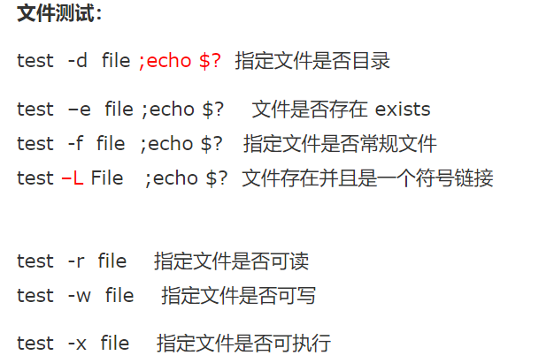

# Shell学习
> 学习Shell的主要目的是能更好地进行实验，大学期间自己也没选linux课，对于shell很生疏
>
> Linux shell推荐工具：tmux+zsh tmux实现终端复用，zsh中可以再装一些插件提高开发效率，而且界面也好看一些
## 基础
- ### 程序运行
  - 运行shell
  
    ```bash
    ./run.sh  # 注意是./run.sh而不是run.sh
    ```
    
  - windows下运行shell
    
    使用git bash
    
  - 设置要调用的shell解释器
  
    ```bash
    #!/bin/bash
    ```
  
  - 设置shell脚本权限
  
    由于默认创建的sh没有执行权限，因此需要chmod
  
    ```bash
    chmod +x run.sh
    ```
  
  - 调用shell时附加参数
  
    ```bash
    sh run.sh 0 abcd 123
    
    echo ${0} #0
    echo ${1} # abcd
    echo $#   # 3
    ```
  
- ### 变量
  
  - 临时环境变量与永久环境变量
    
    临时环境变量为一般环境变量，随控制台生灭
    
    永久环境变量分为：系统变量、用户变量
    
    ```bash
    /etc/profile # 系统变量文件
    $HOME/.bash_profile # 用户变量文件
    # 常见变量
    $HOME
    $PATH
    $PWD
    ```
    
    > 注：.bashrc 与 .bash_profile的区别，bashrc中的内容在每次开启新的控制台都会执行一次，关闭时也会跟着结束（临时变量）
    >
    > .bash_profile在用户登录时执行，属于永久变量
    
  - 定义
  
    ```bash
    name="tangchuan" # 注意=不能有空格
    arr=(1 2 3 4 5) # 注意是空格不是逗号
    ```
  
  - 使用 在定义的变量面前加 `$name`
  
    ```bash
    echo $name
    echo ${a[0]}
    echo ${a[@]} # 输出全部元素
    echo ${#a[@]} # 计数
    ```
  
    
  
  - 类型
  
    | 类型                             | code               |
    | ------------------- | ------------------ |
    | 字符串                           | 'this is a string' "My name is ${name}" |
    | 数组 | a=(1 2 '?' 'hello') |
  
    > 注：字符串单双引号的区别，单引号中不能再出现单引号，双引号中可以插入变量 **${var}**
  
- ### 运算

  ```bash
  `expr 3 + 5`
  sum=$num1+$num2
  \* # 乘号需要转义
  [ expression ] # 条件命令 等同于 test expression
  
  [ 1 == 1 ] ;echo $? # $?返回上一个命令的返回值0表示true，1表示false  分号是命令连接号
  
  
  ```
    > 整数比较符号
    > -eq
    > -ge
    > -le
    > -lt
    > -gt
    > -ne




- ### 其他
  - 注释 #
  - 特殊符号，见参考link

## 控制

### 1. 条件

```bash
if [ 条件判断式1 ]
    then
        当条件判断式1成立时，执行程序1
elif  [ 条件判断式2 ] 
    then      
        当条件判断式2成立时，执行程序2
else
    当所有条件都不成立时，最后执行此程序
fi
```


### 2. 循环

#### for循环

```bash
# for in
for N in 1 2 3
do
echo $N
done

# for((i=0;i<=5;i++))

```


#### while循环

```bash
while expression
do

done
```


## 函数

- 自定义函数

  ```bash
  func() {
  val=$0
  return ${val}
  }
  
  # 调用
  func "hello world"
  ```

  

- 常用函数

| 函数名            | 用途                                 |
| ----------------- | ------------------------------------ |
| echo              | print                                |
| ${#string}        | 输出字符串长度                       |
| ${dtring:1:4}     | 提取字符串                           |
| set               | 展示所有变量                         |
| unset NAME        | 删除某一个变量                       |
| export NAME=value | 声明环境变量（当前shell以及子shell） |


## Reference

- [blog](https://www.cnblogs.com/ggnbnb/p/9671310.html)
- https://www.jb51.net/article/120595.htm